# 知乎加密

​	这个库好久没有更新了主要原因还是二战失败了，导致我的ai征程还没起步就破碎的差不多了，后面再加上各种找工作之类的事情所以一直耽误。有一个好消息和一个对我来说的坏消息，好消息是我找到了一个做爬虫的工作，日后这个库如果问题不大可能会开始恢复更新，坏消息是爬虫这个行业嘛.....作为主业属实是有点不堪了，我自己现在也很迷茫后面该如何发展。

​	嘛，算了聊聊以后这个库的发展方向吧，现在的想法主要有四个核心：

1. 老爬虫大概率是不会继续维护了，因为很多时候维护一个爬虫所耗费的精力一点也不必重新写一个差多少
2. 日后这个库的更新可能更偏向于逆向，应该不太会更新没有营养的新手爬虫了【这几个月在工作岗位上学习了很多】
3. 至于更新内容上来说，主要两个方向：js逆向和安卓逆向【安卓逆向是最近才开始接触，还在学，js逆向除了特别难的瑞数，像是基础的jsvmp还是接触了一些的（像是这次的知乎还有我手里还有一个抖音的ttcid、tt_scid）】。
4. 最后就是这个库日后的更新中可能不会再向之前一样把代码写成体系，奔着没有太大意义数量进军了。更偏向于对单个问题的解决。所以可能就导致没有一定基础的朋友看我写的烂代码既读不懂，又跑不通。但是我个人的话还是会尽可能的将代码写的工整一些，注释多一些的。希望可以与大家相互交流学习。

​	好了，废了那么多话开始这个代码的说明。

[TOC]

## 准备前提

### 开发环境

​	我个人的开发环境是windows10+python3.7.3，使用的ide是pycharm，这次没有做命令行适配，所以建议大家如果有条件还是使用pycharm这种ide去跑，日后也方便。

### 相关库安装

1. 确保自己进入`requirements.txt`这个文件的同级目录之下
2. 运行命令：`pip install -r requirements.txt -i https://pypi.tuna.tsinghua.edu.cn/simple`

#### 库说明

1. requests库，python中最好用的http库，简单高效。
2. loguru库，一个简单高效的日志库。
3. beierTools库，我自己写的一个开发工具库，在这个项目中主要使用了`JsOperation`模块，用于解决python的逻辑运算与js的逻辑运算结果不匹配的问题。

## 运行使用

​	项目中自带了一个例子：[用户](https://www.zhihu.com/people/lai-si-shuang-yu-27)的粉丝页面。直接运行即可以获取到最终结果，如果日志最终输出的结果与下图一致，则证明你成功了。

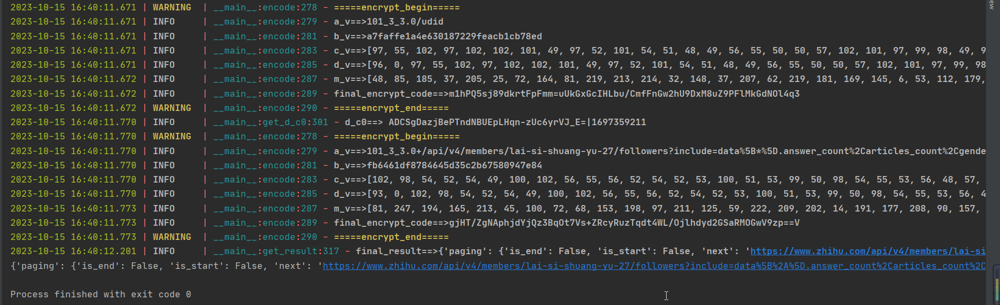

### url的获取

​	这里之所以加了这么一个极其初级的问题，是因为我看issue里真的有人问这些url是怎么获取到的都代表什么意思，所以这里大概告诉一下大家如何去获取自己想要的链接。

​	这个主要涉及一个抓包的问题，如果会自己使用chrome进行抓包的同学可以直接跳过了。如果不会的，那么跟着下面的图片学一个下。

#### 打开开发者工具

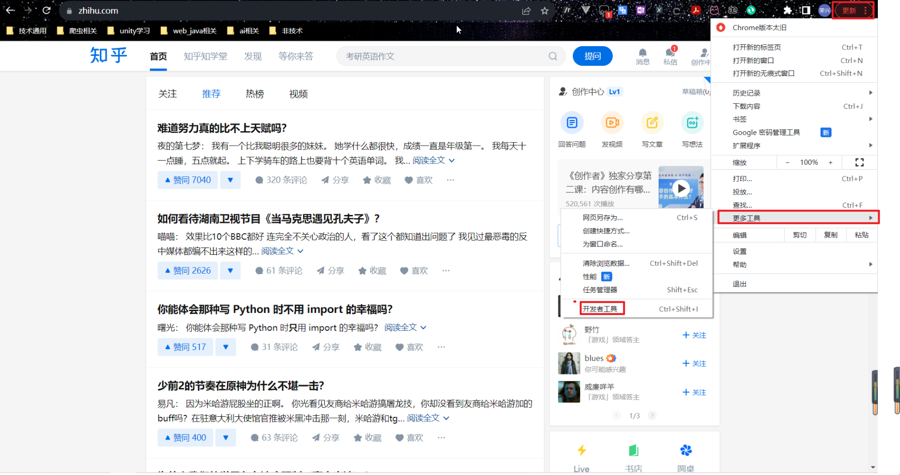

正常来讲快捷键是f12，但是考虑到有些人的快捷键可能发生冲突，这里给出的是使用鼠标点击打开的方式。

### 抓包

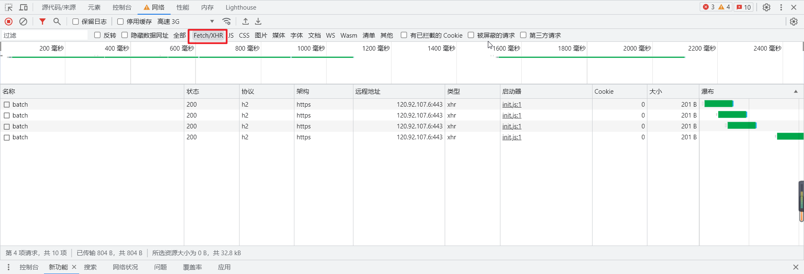

打开之后点击图中XHR这个标签，使后续抓包时自动过滤出XHR请求。然后刷新页面，可以使用f5，也已使用`ctrl+R`都可以。

### 找包


刷新过后我们会获得到一大堆的包，我们需要从这里面找到我们需要的那个接口。这里有一个简单的过滤方法，首先排除掉所有的css和js后缀的包，这些包是加载出来的静态文件，主要用于页面的加载，以及一些js的加密。或者还有一个简单的找包方法：在上一步中不点击刷新，而是直接点击开发者工具中左上角圈起来的那个×，然后下滑页面，这样很多的css和js文件就会被过滤掉，因为他们已经加载过一遍了，在不刷新页面的前提下并不会重新加载。

### 正确包示例

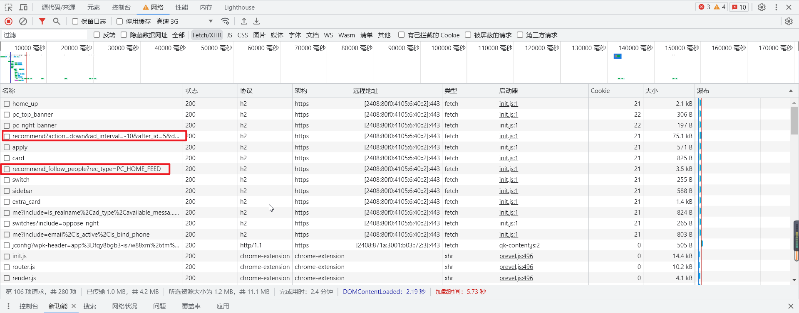

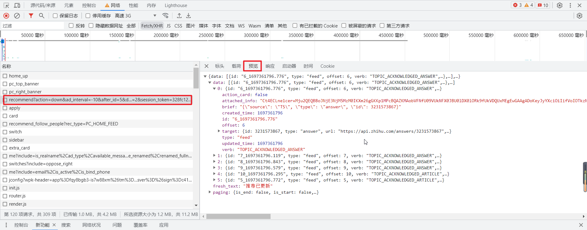

图中圈起来的两个就是我们需要的包，然后我们点击需要的包，就会跳出右侧的这个界面，再点击预览即可看到数据。后面如果需要各种各样的包大家只需要根据类似的流程，找到自己想要的数据包即可。而在找到我们自己想要的包之后，我们就可以对知乎的接口和加密进行分析了。如果大家只是想运行我写好的程序的话，那么到这里基本就可以了。你只需要将这个包的链接完整的复制到脚本的url之后替换掉即可。其余想要自己改参数，进行大量抓取等操作，这里就不进一步说明了。

## 加密分析

​	然后就来到这次代码的核心部分了，如何破解知乎的`X-Zse-96`请求头加密。其实在一年多前我曾经也尝试过使用jsdom配合execjs这两个库对知乎的那个加密进行了补环境，最终效果也确实达到了。但是后来知乎这边更换了一版，加入了jsvmp，从此很长一段时间我都没有更新，就是因为当时对补环境这个操作的认知不够，仅停留在了这有这样再那样那样就可以跑成的阶段。而在公司学习了这段时间后，这次我打算尝试使用多种方式解决一下这个加密。当然最先更新的是直接头铁分析jsvmp的形式。后续可能会有js补环境与app客户端的破解分析。

### 参数分析

​	众所周知，知乎在不登录的情况下依旧可以访问用户主页，问答等页面，所以自然也就没有对cookie做什么有效的限制。更多是寄希望与header中的加密参数。所以就有了下图中的`X-Zse-96`。

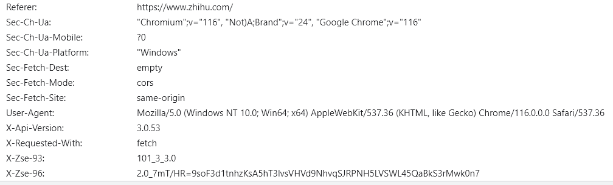

​	而这个参数在定位上也是非常简单的。直接在全局搜索`X-Zse-96`即可定位到具体的加密位置【这就是没有混淆的方便之处】。

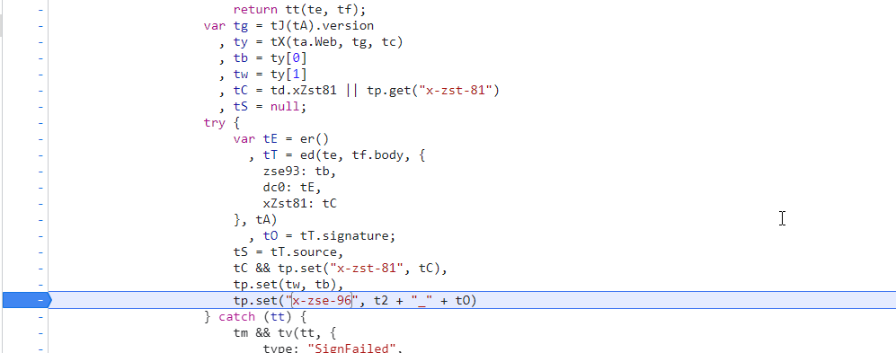

​	而随后的便是简单的栈追踪，这里的栈追踪与一年前的追踪方式基本没有区别，依旧是熟悉的md5，以及一个__g的加密转发，而这也使我当时一直以为加密并没有变。

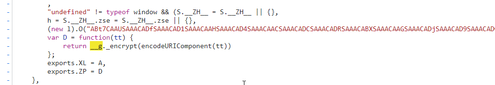

而随着我们追踪到__g.encrypt函数，并进入该函数后，一切都发了变化。我们竟然真的跳转到了一个jsvmp的分支中。

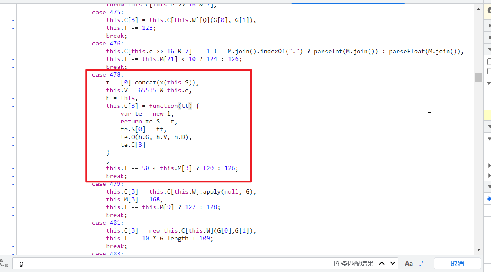

​	而比较好玩的一点是，知乎在这个jsvmp中加入了一个时间检测，用于探测用户是否在使用开发者工具进行debug。如果代码运行时间过长则判定为被攻击了，从而直接从分支流程中跳出循环。但是这基本没什么大作用，因为我们有**日志点**。

### 日志点的使用

​	日志点这个东西可谓是应对jsvmp的一大杀器。我们只需要找到整个循环流程的最顶端，在进入分之前打上一个日志点，并且输出我们想要观察的变量即可扒光jsvmp的内裤【当然，上有政策下有对策，个人感觉最变态的还得属瑞数的动态加载js，每次加载出来的变量名都不同，还都是乱码。】

#### 找到循环流程顶并打印日志

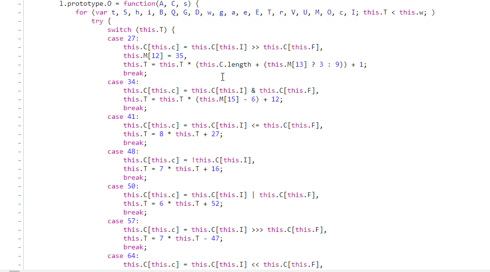

通过不断向上找，我们最终可以发现整个流程分支的起始点就是这个for循环。而this.T就是控制整个循环流程的变量。那此时我们就可以在这里打一个这样的日志点：

```js
// 这里除了this.T其余都是我想要观察的变量，这里可以提前透露一下，最终的加密结果和计算就存放在this.C之中。
this.T, this.C, this.S, this.i
```

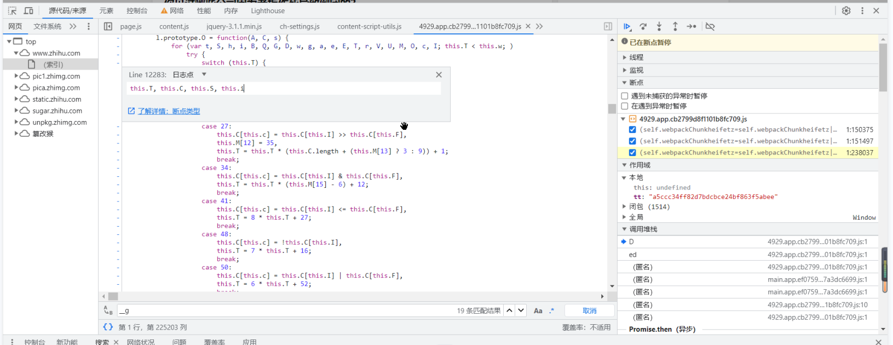

日志点打的方式是：右键点击想要打断点的地方，选择日志点，输入上面给出的日志点代码即可。

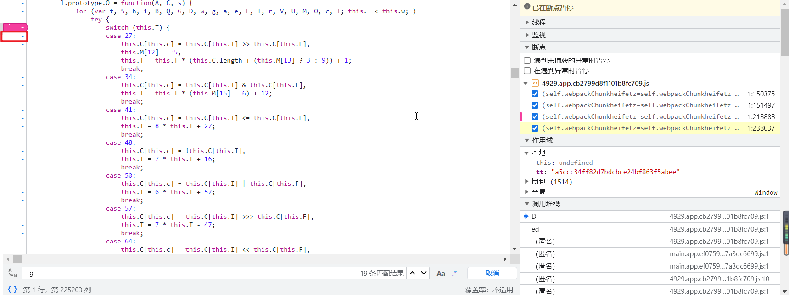

而后我们刷新就OK了，当然更好的办法并不是刷新，而是下拉，这样可以避免很多没有必要的加载。

刷新过后，我们选择进入控制台，此时我们就会发现有大量的日志正在疯狂跳出。而我们需要做的仅是等他全部加载完毕。当然一些比较繁琐的网站，可能需要我们自己先打一个断点在最终加载完成处【这个在此次解密中不重要】

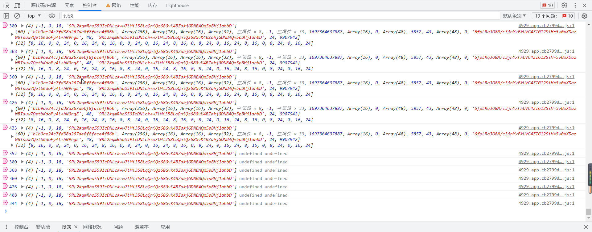

而后我们右键控制台日志，选择保存日志，之后我们便可以开始分析他的加密流程了。这次我个人推荐使用vscode进行分析。其相对于nodepad等文本编辑器，着色效果会更好，很多时候都不需要所有，只需要选中即可清楚看到加密流程。

#### 日志分析

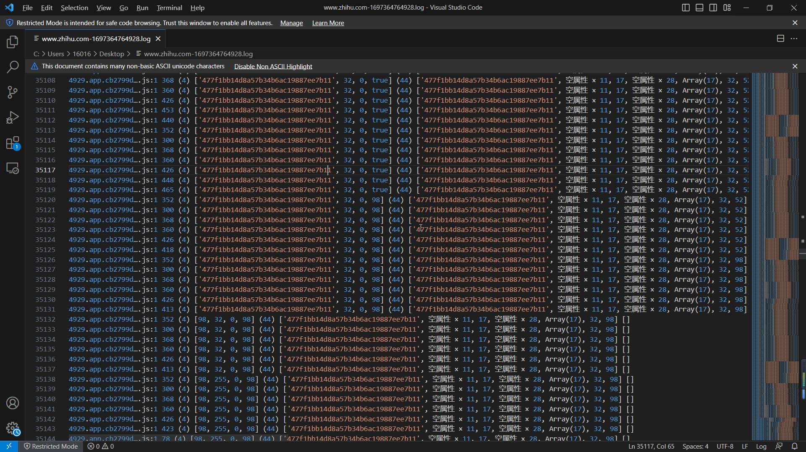

​	而后便是对这上图这个文件进行日志分析了，日志分析这东西吧说实话就是考的一个耐心和时间，基本上没有什么可以教大家的点。我自己在对这个日志进行分析的时候有一个小技巧可能会对大家有帮助【但也仅限知乎这次分析，因为知乎的js代码并没有进行混淆】。

​	我们可以保存一个知乎的js加密代码到本地，并将日志与这个js代码结合着分析。这里我们可以看到主要进行流程控制的this.T的值是日志中每一行的第一位。而流程控制主要是由一个switch case进行控制的。所以当我们想要看某一行日志所对应的js代码操作时，我们就可以在我们保存在本地的js代码中搜索`case 278`这样的条件控制流。

​	这里再次小剧透一下，其实所有的逻辑运算基本上都集中于两位数那块，什么`case 71`、`case 64`、`case 78`。所以在日志分析时如果遇见了这些数字则可以重点注意一下，因为极有可能是要进行什么运算了。而像是什么`case 426`之类的则完全不需要耗费精力去看，多是一些取数、改变控制流程的无意义操作。

## 代码

​	当然整个分析流程不可能全都放到一个readme里，这里主要还是向一些小白普及一些基础方法。让一些想要挑战自己的小伙伴可以有一个把手，从而自己尝试分析一下。

​	而另一个理所当然的是，既然我把代码写出来了，那么肯定就是会有一个流程上的总结，而这一部分我都放到了脚本代码中的最开头，从最开始的url直到如何加密出最终的密文都是有的。从最基础的逻辑流程到每一个细节函数算法的代码复现也都在脚本开头写明了。如果大家好奇可以直接查看。

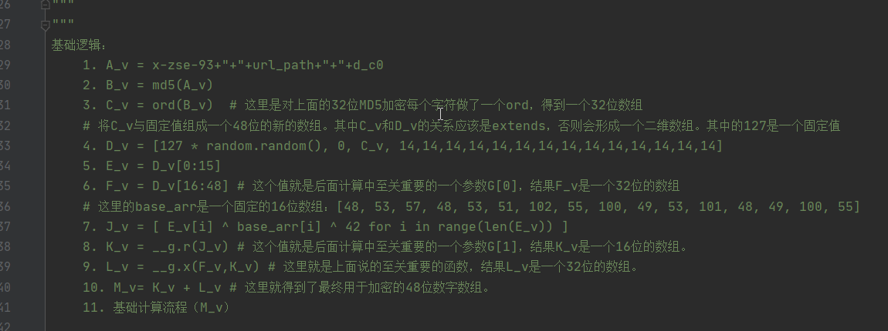

## 总结

​	作为我自己逆向并发出来的第一个jsvmp，还是和大家叨叨了很多废话。也希望大家可以在这个项目中学到一些基础的爬虫知识。同时也欢迎大家多多向该库提出issue，或是在issue中进行讨论。一切都以学习交流为目的嘛。

## 更新

#### 2023.10.18

​	知乎pc版，补环境：[js文件](https://github.com/srx-2000/spider_collection/blob/master/zhihuEncrypt/zhihu_encrypt_js.js)、[py脚本文件](https://github.com/srx-2000/spider_collection/blob/master/zhihuEncrypt/zhihu_encrypt_js.py)

#### 2023.10.15

​	知乎pc版，硬逆向：[py脚本文件](https://github.com/srx-2000/spider_collection/blob/master/zhihuEncrypt/zhihu_encrypt.py)

## 鸣谢

​	在此感谢[b站教学](https://www.bilibili.com/video/BV1fr4y1R7XQ/?spm_id_from=333.1007.top_right_bar_window_history.content.click&vd_source=fc7ee585e1ddf246f30a0860b09ef366)，本子项目中pc版补环境参考学习了该视频中的方法与流程。

## 声明

​	该脚本仅用于学习交流，如有非法使用本人概不负责。

